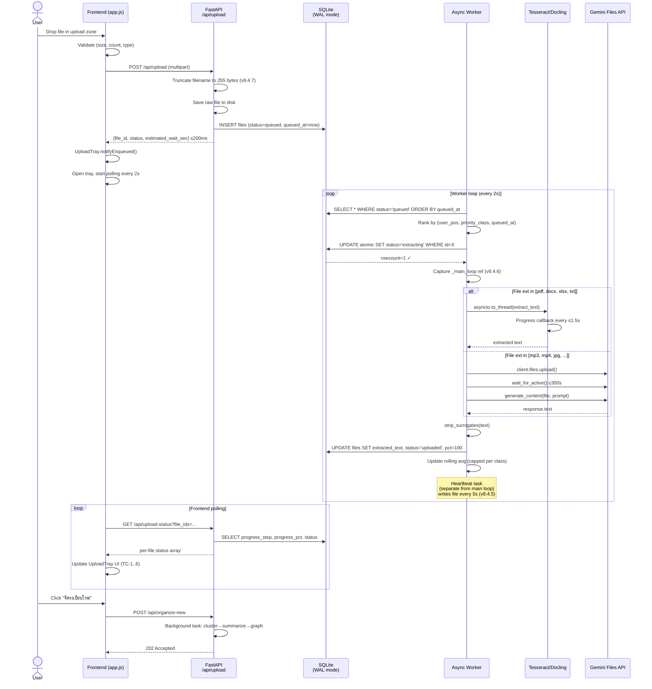
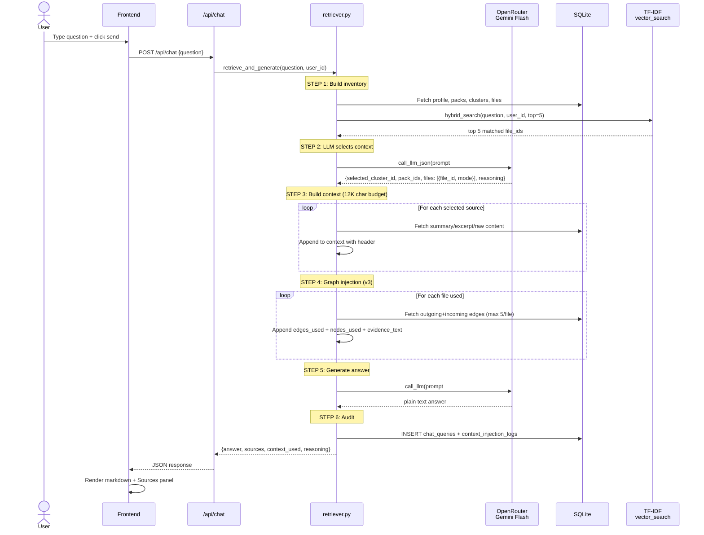
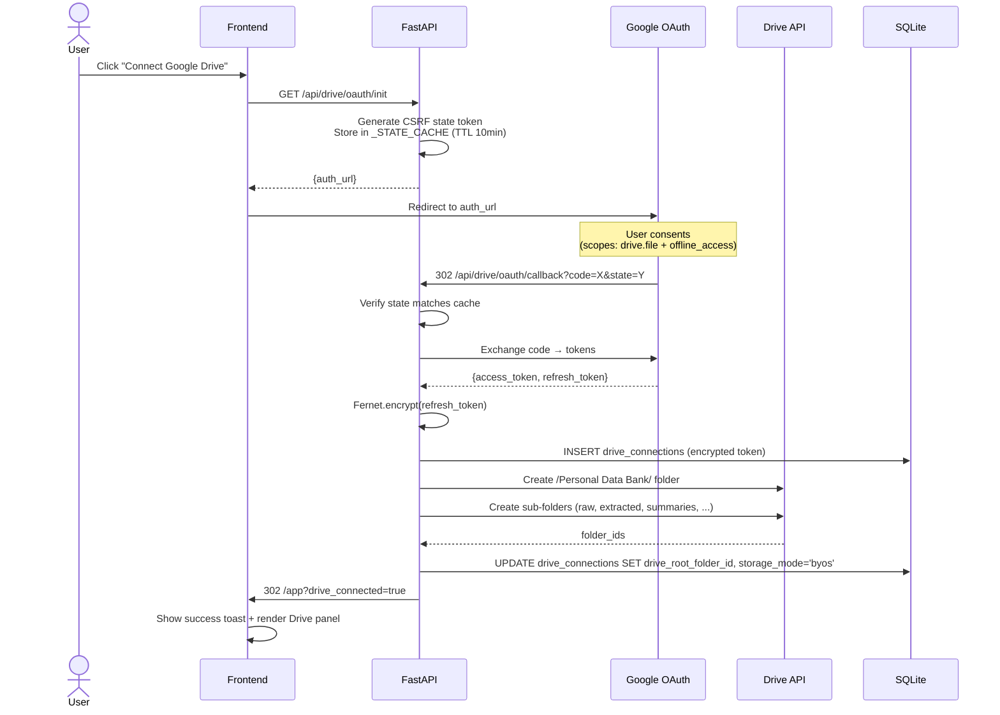
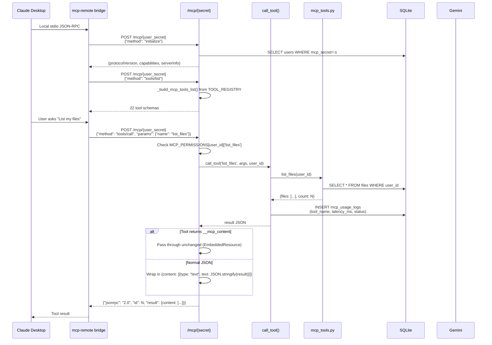
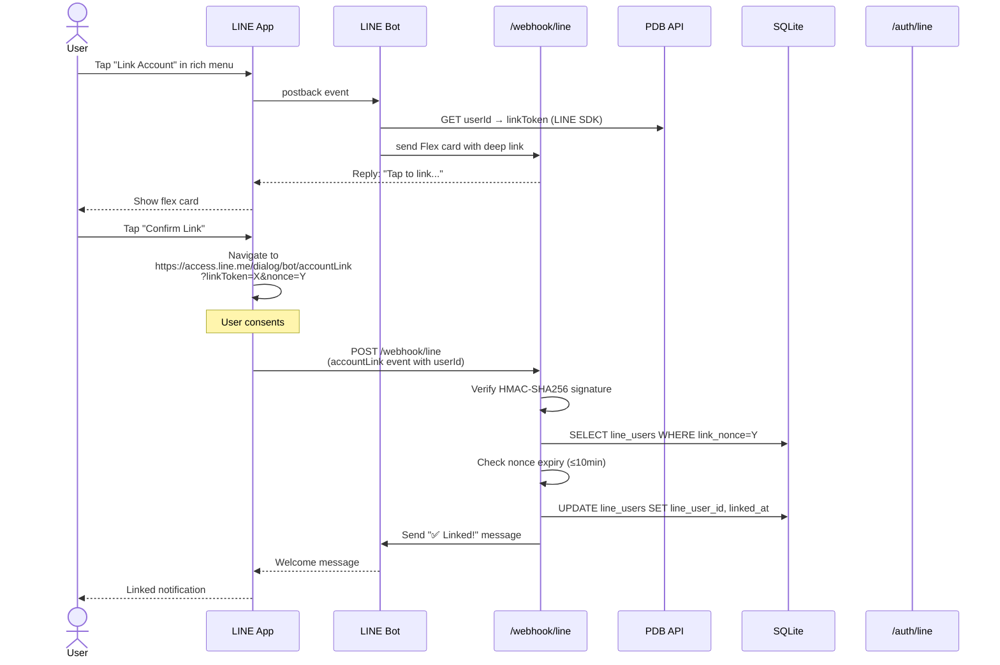
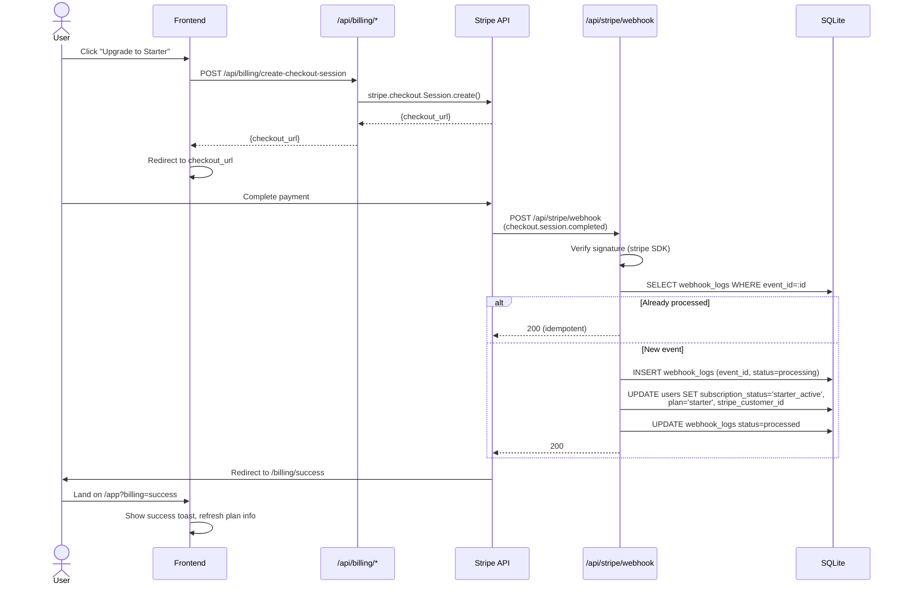
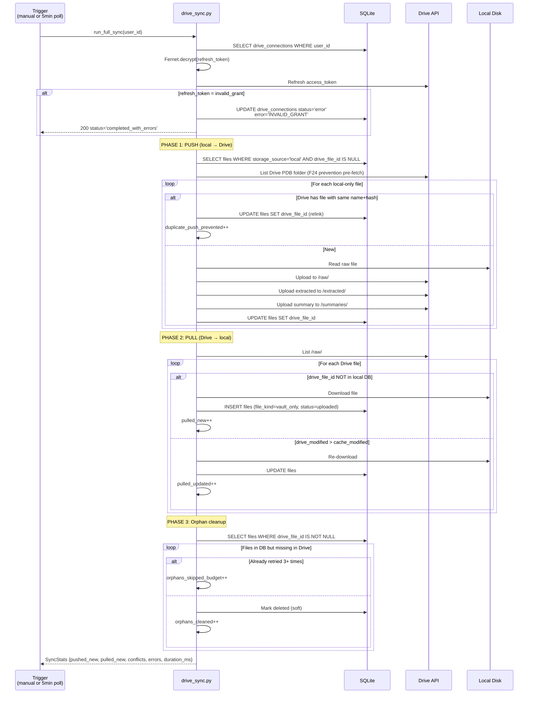

# 04 — Architecture Diagrams (Mermaid)

> **Purpose:** Visual diagrams สำหรับ developer ใช้เข้าใจ flow + ความสัมพันธ์
> **Format:** Mermaid (text-based) — render ผ่าน GitHub / VS Code Markdown Preview / Mermaid Live Editor
> **Coverage:** Database ERD + 6 sequence diagrams สำหรับ critical flows

---

## 1. Database ERD

```mermaid
erDiagram
    USERS ||--o{ FILES : owns
    USERS ||--o{ CLUSTERS : owns
    USERS ||--o{ CONTEXT_PACKS : owns
    USERS ||--o{ CONTEXT_MEMORIES : owns
    USERS ||--o| USER_PROFILES : has
    USERS ||--o| DRIVE_CONNECTIONS : has
    USERS ||--o{ MCP_TOKENS : owns
    USERS ||--o{ CHAT_QUERIES : sends
    USERS ||--o{ PERSONALITY_HISTORY : tracks
    USERS ||--o{ USAGE_LOGS : tracks
    USERS ||--o{ AUDIT_LOGS : tracks
    USERS ||--o| LINE_USERS : linked
    USERS ||--o{ GRAPH_NODES : owns
    USERS ||--o{ GRAPH_EDGES : owns
    USERS ||--o{ NOTE_OBJECTS : owns

    FILES ||--o| FILE_SUMMARIES : has
    FILES ||--o| FILE_INSIGHTS : has
    FILES ||--o{ FILE_CLUSTER_MAP : in
    
    CLUSTERS ||--o{ FILE_CLUSTER_MAP : groups
    
    CONTEXT_PACKS ||--o{ PACK_SHARES : sharable
    
    GRAPH_NODES ||--o{ GRAPH_EDGES : source
    GRAPH_NODES ||--o{ GRAPH_EDGES : target
    GRAPH_NODES ||--o{ SUGGESTED_RELATIONS : source
    
    CHAT_QUERIES ||--o| CONTEXT_INJECTION_LOGS : audit
    
    MCP_TOKENS ||--o{ MCP_USAGE_LOGS : produces

    USERS {
        string id PK
        string email UK "nullable"
        string password_hash "nullable"
        string google_sub UK "v8.1"
        boolean is_admin "v8.2"
        string mcp_secret UK "v5.1"
        string plan "free|starter|admin"
        string subscription_status
        string stripe_customer_id
        string storage_mode "managed|byos v7.0"
        boolean is_active
        timestamp created_at
    }
    
    FILES {
        string id PK
        string user_id FK
        string filename "truncated to 255 bytes v9.4.7"
        string filetype
        string raw_path
        text extracted_text
        string processing_status "uploaded|queued|extracting|organized|ready|error"
        string extraction_status "ok|empty|encrypted|ocr_failed|unsupported|partial"
        text tags "JSON array"
        string drive_file_id "v7.0"
        string content_hash "SHA-256 v7.1"
        string file_kind "processed|vault_only v9.1"
        timestamp queued_at "v9.4.0"
        timestamp extract_started_at "v9.4.0"
        timestamp extract_completed_at "v9.4.0"
        string progress_step "v9.4.0"
        int progress_pct "v9.4.0"
        string extract_error "CODE v9.4.0"
        int attempt_count "v9.4.0"
        boolean is_locked
    }
    
    USER_PROFILES {
        int id PK
        string user_id FK UK
        text identity_summary
        text goals
        text working_style
        text preferred_output_style
        string mbti_type "v6.0"
        string mbti_source
        text enneagram_data "JSON v6.0"
        text clifton_top5 "JSON v6.0"
        text via_top5 "JSON v6.0"
    }
    
    DRIVE_CONNECTIONS {
        int id PK
        string user_id FK UK
        string drive_email
        text refresh_token_encrypted "Fernet"
        string drive_root_folder_id
        timestamp last_sync_at
        string last_sync_status "pending|syncing|success|error"
        timestamp revoked_at
    }
    
    MCP_TOKENS {
        string id PK
        string user_id FK
        string token_hash UK "SHA-256"
        string label
        string scope
        boolean is_active
        timestamp last_used_at
        timestamp revoked_at
    }
```

**26 tables total** — see [SDD-blueprint.md §3](00-SDD-blueprint.md) for complete column listings.

---

## 2. Upload Pipeline (Sequence)



**Key invariants:**
- Atomic claim SQL prevents race condition
- Progress callback uses `asyncio.run_coroutine_threadsafe(_main_loop)` (v9.4.6 fix)
- Heartbeat task separate from main loop survives long jobs (v9.4.5 fix)
- Rolling avg cap per class prevents outlier pollution (v9.4.8)

---

## 3. Chat Retrieval (7-Layer Sequence)



**7 layers in priority order:**
1. User Profile (identity + goals + style + personality)
2. Context Packs (selected by LLM)
3. Files — Summary mode
4. Files — Excerpt mode (first 2000 chars)
5. Files — Raw mode (first 6000 chars)
6. Graph Nodes & Edges (v3 graph-aware)
7. Hybrid Vector Search (TF-IDF + semantic)

**MAX_CONTEXT_CHARS = 12000** (hard budget)

---

## 4. Google OAuth Flow (Drive BYOS)



**Critical:**
- `_GLOGIN_STATE_CACHE` (login) แยกจาก `_STATE_CACHE` (Drive) — intent isolation
- Refresh token = Fernet encrypted at rest
- `GOOGLE_OAUTH_MODE=testing` → 7-day refresh token expiry
- All push helpers must handle `RefreshError` → mark connection errored (STORAGE-006)

---

## 5. MCP Tool Call (JSON-RPC 2.0)



**Auth pattern:**
- Primary: `/mcp/{secret}` (per-user UUID in URL — Claude Custom Connector ใส่ Bearer ไม่ได้)
- Secondary: `Authorization: Bearer pk_<48hex>` (SHA-256 hash lookup)

---

## 6. LINE Account Link Flow



**Critical:**
- Nonce = `secrets.token_hex(32)` (64 hex chars, alphanumeric only)
- LINE rejects base64url (has `-`/`_`)
- HMAC-SHA256 signature verify on every webhook
- Server-initiated link not possible per LINE spec — must go via bot follow

---

## 7. Stripe Subscription Flow



**Idempotency:** Webhook event_id checked in `webhook_logs` table before processing

**Events handled:**
- `checkout.session.completed` → flip to "starter_active"
- `customer.subscription.updated` → update renewal + status
- `customer.subscription.deleted` → downgrade to "free" + lock excess data
- `invoice.payment_succeeded` → audit log

---

## 8. BYOS Drive Sync (Push-then-Pull)



**Conflict resolution:** Drive wins (last-write-wins on modifiedTime)
**Orphan budget:** 3 retries per file per session (in-memory dict)
**F24 prevention:** Pre-fetch Drive listing → relink if name+hash match (v9.3.5.5)

---

## 9. Frontend Page Routing (No-Hash)

```mermaid
stateDiagram-v2
    [*] --> Landing : Page load
    
    Landing --> Auth_Check : initAuth()
    Auth_Check --> App_MyData : token valid (/api/auth/me 200)
    Auth_Check --> Landing : no token or 401
    
    state App {
        [*] --> MyData
        MyData --> Knowledge : nav click
        MyData --> Graph : nav click
        MyData --> Chat : nav click
        MyData --> ContextMemory : nav click
        MyData --> MCPSetup : nav click
        MyData --> Tokens : nav click
        MyData --> MCPLogs : nav click
        
        Knowledge --> MyData
        Graph --> MyData
        Chat --> MyData
        ContextMemory --> MyData
        MCPSetup --> MyData
        Tokens --> MyData
        MCPLogs --> MyData
        
        state Profile {
            note right of Profile: Slide-in panel<br/>(not a page)
        }
        
        MyData --> Profile : profile icon
        Profile --> MyData : close
    }
    
    App_MyData --> App
    App --> Landing : Logout / 401
```

**Routing pattern:** Class-toggle `.page` + `.page.active` (no URL hash)
**Profile** = slide-in panel `.slide-panel` (not a `.page`)

---

**End — 9 diagrams covering: ERD + Upload + Chat + OAuth + MCP + LINE + Stripe + BYOS Sync + Frontend Routing**
