# 08 — User Flow Diagrams

> **Purpose:** มุมมอง user journey — สิ่งที่ user เห็น + กดในแต่ละ step
> **Format:** Mermaid `flowchart` — render ผ่าน GitHub / VS Code / Mermaid Live Editor
> **ต่างจาก Doc 04 อย่างไร:** Doc 04 = system component-to-component sequence. Doc 08 = user UI journey end-to-end
> **Coverage:** 10 critical user journeys

---

## ตารางสรุป

| # | User Flow | When | Endpoints involved |
|---|---|---|---|
| 1 | First-time Onboarding | New user สมัครครั้งแรก | `/api/auth/register` + first upload |
| 2 | Returning User | Login + continue work | `/api/auth/login` + `/api/auth/me` |
| 3 | Upload Journey | Drop file → done | `/api/upload` + polling |
| 4 | Knowledge Build | Organize + review | `/api/organize` + clusters + packs |
| 5 | AI Chat | Question → answer + sources | `/api/chat` |
| 6 | MCP Setup | Connect Claude | `/api/mcp/*` |
| 7 | BYOS Drive Connect | Enable Drive storage | `/api/drive/oauth/*` |
| 8 | Subscription Upgrade | Free → Starter | `/api/billing/*` + Stripe |
| 9 | LINE Bot Link | Link LINE account | LINE webhook + `/auth/line` |
| 10 | Password Reset | Forgot password | `/api/auth/request-reset` + `/api/auth/reset-password` |

---

## 1. First-time Onboarding

**When:** ผู้ใช้ใหม่เข้าครั้งแรก — landing → register → first upload → first organize → first chat

```mermaid
flowchart TD
    Start([User เข้า https://yourdomain.com]) --> Landing[/landing.html<br/>Hero + features + pricing/]
    Landing --> ClickStart{คลิก Sign Up?}
    ClickStart -- ไม่ --> Browse[อ่าน pricing / features]
    Browse --> ClickStart
    ClickStart -- ใช่ --> Modal[/Auth Modal เปิด/]
    
    Modal --> Choice{เลือกวิธี?}
    Choice -- Email --> RegForm[กรอก email + password]
    RegForm --> POST1["POST /api/auth/register"]
    Choice -- Google --> GoogleBtn[คลิก Sign up with Google]
    GoogleBtn --> POST2["GET /api/auth/google/init"]
    POST2 --> GoogleConsent[Google consent screen]
    GoogleConsent --> Callback["GET /api/auth/google/callback"]
    
    POST1 --> Success{Success?}
    Callback --> Success
    Success -- ไม่ --> Error[Toast: error message]
    Error --> Modal
    Success -- ใช่ --> SaveToken[localStorage.pdb_token = JWT<br/>localStorage.pdb_user = user obj]
    SaveToken --> Redirect[Redirect ไป /app]
    
    Redirect --> Empty[/app page-my-data<br/>Empty state แสดง:<br/>ยังไม่มีไฟล์/]
    Empty --> UploadZone{Drop file หรือ คลิก?}
    UploadZone --> Validate[Frontend validate:<br/>size <200MB, count <50]
    Validate --> POST3["POST /api/upload (multipart)"]
    POST3 --> TrayOpen[/UploadTray เปิด<br/>โชว์ ตัวอย่าง.pdf เข้าคิว/]
    TrayOpen --> Poll[Poll /api/upload-status every 2s]
    Poll --> Done{Status?}
    Done -- queued --> Poll
    Done -- extracting --> ProgressShow[แสดง: OCR หน้า 5/20]
    ProgressShow --> Poll
    Done -- uploaded --> FileShow[/File card ปรากฏใน list/]
    Done -- error --> ShowError[Retry + Dismiss buttons]
    ShowError --> Decision[User กด Retry หรือ Dismiss]
    
    FileShow --> Suggest[Banner: จัดระเบียบไฟล์ใหม่ ?]
    Suggest --> OrgBtn{คลิก จัดระเบียบ?}
    OrgBtn -- ใช่ --> POST4["POST /api/organize-new"]
    POST4 --> OrgProgress[/Loading: AI กำลังจัดกลุ่ม/]
    OrgProgress --> OrgDone[/Knowledge page<br/>มี Collections + Summary/]
    
    OrgDone --> ChatPrompt[Navigate: AI Chat]
    ChatPrompt --> FirstQuestion[พิมพ์: สรุปไฟล์นี้ให้หน่อย]
    FirstQuestion --> POST5["POST /api/chat"]
    POST5 --> Answer[/AI ตอบ + Sources panel/]
    Answer --> End([User เข้าใจระบบ ✓])
    
    style Start fill:#22c55e,stroke:#16a34a,color:#fff
    style End fill:#22c55e,stroke:#16a34a,color:#fff
    style Error fill:#ef4444,stroke:#dc2626,color:#fff
    style ShowError fill:#f59e0b,stroke:#d97706,color:#fff
```



**Critical UX moments:**
- **Time to first value:** ≤ 3 นาที (register → upload → see organize)
- **Empty state importance:** ถ้าไม่ทำดี → user bounce — ต้องมี clear CTA
- **Progress trust:** TC-1..6 (no fake %) — ระบุไว้ใน [SDD §11.6](00-SDD-blueprint.md#116-uploadtray-module-critical-ux)

---

## 2. Returning User (Daily Use)

**When:** User กลับมาใช้ — login → ดู dashboard → ทำงานต่อ

```mermaid
flowchart TD
    Start([User เปิด https://yourdomain.com]) --> CheckToken{มี localStorage.pdb_token?}
    
    CheckToken -- ไม่ --> Landing[/landing.html/]
    Landing --> Login[Click Sign In]
    Login --> AuthModal[Auth Modal]
    AuthModal --> Submit["POST /api/auth/login"]
    Submit --> Token[Save JWT]
    Token --> AppLoad
    
    CheckToken -- มี --> VerifyToken["GET /api/auth/me<br/>(_background: true)"]
    VerifyToken --> Valid{Valid?}
    Valid -- ไม่ 401 --> doLogout[doLogout&#40;&#41;]
    doLogout --> Landing
    Valid -- ใช่ --> AppLoad[showApp&#40;&#41;<br/>_isInitVerified = true]
    
    AppLoad --> Sidebar[/Sidebar + 8 pages<br/>page-my-data active by default/]
    Sidebar --> InitData[initAppData&#40;&#41;<br/>โหลด profile + files + stats]
    InitData --> Dashboard[/แสดง:<br/>- File count<br/>- Recent uploads<br/>- Quick actions/]
    
    Dashboard --> UserChoice{User ต้องการอะไร?}
    UserChoice -- จัดการไฟล์ --> MyData[Page: My Data]
    UserChoice -- ค้นหา --> Knowledge[Page: Knowledge]
    UserChoice -- ถาม AI --> Chat[Page: AI Chat]
    UserChoice -- ดู Graph --> Graph[Page: Graph]
    UserChoice -- ตั้งค่า Profile --> ProfilePanel[Slide-in: Profile]
    UserChoice -- Setup MCP --> MCP[Page: MCP Setup]
    
    MyData --> Continue[ทำงานต่อ...]
    Knowledge --> Continue
    Chat --> Continue
    Graph --> Continue
    ProfilePanel --> Save[คลิก Save → PUT /api/profile]
    Save --> Continue
    MCP --> Continue
    
    Continue --> End([Session active])
    
    style Start fill:#22c55e,stroke:#16a34a,color:#fff
    style End fill:#22c55e,stroke:#16a34a,color:#fff
    style doLogout fill:#ef4444,stroke:#dc2626,color:#fff
```



**Key auth state machine flags:**
- `_isInitVerified` — ป้องกัน logout ตอน 401 ก่อน first verify เสร็จ
- `_logoutDebounce` — 5s window กัน toast ซ้ำ
- `_background: true` option ใน authFetch — บอกว่า "ห้าม logout บน 401"

---

## 3. Upload Journey (Drop → Done)

**When:** User upload ไฟล์ — drag/select → progress → outcome

```mermaid
flowchart TD
    Start([User เปิด My Data page]) --> Action{Action?}
    Action -- Drag --> Drop[ลากไฟล์มาวางใน upload-zone]
    Action -- Click --> Picker[เลือกไฟล์จาก file picker]
    
    Drop --> Validate
    Picker --> Validate[Frontend validate:<br/>- File size ≤ max_file_size_mb<br/>- Count ≤ 20 หรือ 50 hard limit<br/>- Type supported]
    
    Validate --> ValidOK{Valid?}
    ValidOK -- ไม่ --> Toast1[Toast: ไฟล์ไม่รองรับ]
    Toast1 --> Start
    
    ValidOK -- ใช่, count>20 --> Warn[/Modal: เกินที่แนะนำ/]
    Warn --> UserChoice{ดำเนินต่อ?}
    UserChoice -- ยกเลิก --> Start
    UserChoice -- ต่อ --> POST
    
    ValidOK -- ใช่, count≤20 --> POST["POST /api/upload (multipart)"]
    POST --> Response{Response?}
    
    Response -- 402 Plan Limit --> Upsell[/Modal: เกินโควต้า<br/>+ Upgrade button/]
    Upsell --> End1([Decision: upgrade or wait])
    
    Response -- 200 --> Optimistic["UploadTray.notifyEnqueued&#40;&#41;<br/>เปิด tray ทันที"]
    Optimistic --> StartPoll[เริ่ม poll /api/upload-status<br/>every 2 วินาที]
    
    StartPoll --> CheckStatus[Read processing_status<br/>+ progress_step + progress_pct]
    CheckStatus --> Status{Status?}
    
    Status -- queued --> ShowPosition[Pill: รอคิว<br/>Step: อันดับที่ 3 — กำลังรอคิว]
    ShowPosition --> Wait[รอ 2s]
    Wait --> CheckStatus
    
    Status -- extracting --> ShowProgress[Pill: กำลังทำ<br/>Meter: pct% if known else indeterminate<br/>Step: OCR หน้า 5/20]
    ShowProgress --> Wait2[รอ 2s]
    Wait2 --> CheckStatus
    
    Status -- error --> ShowError[/Pill: ล้มเหลว<br/>Error code: ENCRYPTED/TIMEOUT/etc.<br/>Buttons: ลองใหม่ / ลบออก/]
    ShowError --> ErrorAction{User?}
    ErrorAction -- ลองใหม่ --> Retry["POST /api/upload/{id}/retry"]
    Retry --> StartPoll
    ErrorAction -- ลบออก --> Dismiss["POST /api/upload/{id}/dismiss-error"]
    Dismiss --> Remove[Remove from tray]
    
    Status -- uploaded --> Success[/Pill: เสร็จแล้ว<br/>Meter: 100%/]
    Success --> AutoRemove[หลัง 2s: remove from tray]
    AutoRemove --> FileList[/File ปรากฏใน My Data list/]
    FileList --> Suggest[Banner: ไฟล์ใหม่ — จัดระเบียบไหม?]
    Suggest --> End2([User: organize หรือ ทำงานต่อ])
    
    Status -- ถ้า>30 ticks --> Backoff[เปลี่ยน poll interval → 5s]
    Backoff --> CheckStatus
    
    Status -- "system degraded" --> Banner[/Banner: ระบบประมวลผลล่าช้ากว่าปกติ/]
    Banner --> CheckStatus
    
    style Success fill:#22c55e,stroke:#16a34a,color:#fff
    style ShowError fill:#ef4444,stroke:#dc2626,color:#fff
    style Upsell fill:#f59e0b,stroke:#d97706,color:#fff
    style End2 fill:#22c55e,stroke:#16a34a,color:#fff
```



**TC-1..6 enforced in UI:**
- TC-1: indeterminate meter เมื่อ `progress_pct_known = false`
- TC-2: timestamps แสดงเวลาจริง
- TC-3: why_slow text from backend ไม่ใช่ guess
- TC-4: estimated_wait_sec จาก rolling avg
- TC-5: error CODE map เป็น user-friendly TH/EN
- TC-6: system status banner from backend

---

## 4. Knowledge Build (Organize → Review → Pack)

**When:** หลังอัปไฟล์ ผู้ใช้กดจัดระเบียบ → ได้ collections + summaries → สร้าง context pack

```mermaid
flowchart TD
    Start([User ที่หน้า My Data]) --> CheckFiles{มีไฟล์ uploaded แต่ยัง organize?}
    CheckFiles -- ไม่ --> Wait[รอ upload เสร็จก่อน]
    CheckFiles -- ใช่ --> Banner[/Banner: ไฟล์ใหม่ X ไฟล์ — จัดระเบียบเลย/]
    
    Banner --> ClickOrg{Click จัดระเบียบไฟล์ใหม่?}
    ClickOrg -- ไม่ --> Skip[ทำต่อไป]
    ClickOrg -- ใช่ --> POST["POST /api/organize-new"]
    
    POST --> Loading[/Loading overlay:<br/>AI กำลังจัดกลุ่ม.../]
    
    Loading --> Pipeline[Backend pipeline:<br/>1. cluster files prompt #1<br/>2. importance score<br/>3. summary per file prompt #2 or #3+#4<br/>4. duplicate detection<br/>5. graph build]
    
    Pipeline --> DupCheck{พบไฟล์ซ้ำ?}
    DupCheck -- ใช่ --> DupModal[/Modal: พบไฟล์คล้าย N ไฟล์<br/>- per-file: เก็บทั้งคู่ / ข้าม<br/>- quick: เก็บทั้งหมด / ข้ามทั้งหมด/]
    DupModal --> UserPick{User?}
    UserPick -- เก็บทั้งหมด --> Keep[Skip dedup]
    UserPick -- ข้ามทั้งหมด --> SkipAll[10s undo window]
    SkipAll --> UndoCheck{Undo?}
    UndoCheck -- ใช่ --> Keep
    UndoCheck -- ไม่ --> SkipAPI["POST /api/files/skip-duplicates"]
    SkipAPI --> Done
    Keep --> Done
    
    DupCheck -- ไม่ --> Done[/Toast: จัดระเบียบเรียบร้อย/]
    
    Done --> NavKnow[Navigate to Knowledge page]
    NavKnow --> KnowPage[/Knowledge page — Collections tab/]
    
    KnowPage --> Collections[/Cards: 6 clusters<br/>- Title<br/>- Summary<br/>- File count<br/>- Top files/]
    
    Collections --> ClickCluster{Click cluster?}
    ClickCluster -- ใช่ --> ClusterDetail[/Expanded view<br/>- Full file list<br/>- Each with importance score<br/>- Each with summary/]
    ClusterDetail --> FileClick{Click file?}
    FileClick -- ใช่ --> DetailPanel[/Slide-in panel:<br/>- Full summary<br/>- Topics + Facts<br/>- Metadata<br/>- Relations/]
    
    DetailPanel --> AskAI{Click ถาม AI?}
    AskAI -- ใช่ --> Chat[Navigate to Chat with pre-filled context]
    
    KnowPage --> SwitchTab{เปลี่ยน tab?}
    SwitchTab -- Notes --> NotesTab[/Notes & Entities/]
    SwitchTab -- Packs --> PacksTab[/Context Packs<br/>+ Create Pack button/]
    
    PacksTab --> CreatePack{Create new pack?}
    CreatePack -- ใช่ --> PackModal[/Modal: Pack AI Builder/]
    
    PackModal --> Step1[Step 1: User types prompt]
    Step1 --> POST2["POST /api/context-packs/ai-build/clarify"]
    POST2 --> Skip{skip_clarify?}
    
    Skip -- ใช่ --> Step3
    Skip -- ไม่ --> Step2[/Step 2: 4 clarifying options<br/>+ freetext input/]
    Step2 --> Pick[User pick option หรือ type]
    Pick --> Step3
    
    Step3["POST /api/context-packs/ai-build/propose"]
    Step3 --> Preview[/Preview draft:<br/>- Title + Type<br/>- Intent + Scope<br/>- Selected sources/]
    
    Preview --> Confirm{Confirm?}
    Confirm -- Discard --> PacksTab
    Confirm -- Create --> POST3["POST /api/context-packs"]
    POST3 --> PackCard[/Pack ปรากฏใน list/]
    PackCard --> End([Knowledge organized ✓])
    
    style End fill:#22c55e,stroke:#16a34a,color:#fff
    style PackCard fill:#22c55e,stroke:#16a34a,color:#fff
```



---

## 5. AI Chat (Ask → Answer → Refine)

**When:** ผู้ใช้ถาม AI เกี่ยวกับข้อมูลของตัวเอง

```mermaid
flowchart TD
    Start([User เข้า Chat page]) --> Welcome[/Welcome message:<br/>สวัสดี! ถามอะไรก็ได้.../]
    Welcome --> Input[Textarea: พิมพ์คำถาม]
    
    Input --> Send{Click ส่ง?}
    Send -- ใช่ --> AddBubble[Add user bubble in messages]
    AddBubble --> Loading[/AI กำลังคิด.../ ]
    Loading --> POST["POST /api/chat {question}"]
    
    POST --> Retriever[Backend retriever 7-layer:<br/>1. Profile<br/>2. Context Packs<br/>3. Files Summary<br/>4. Files Excerpt<br/>5. Files Raw<br/>6. Graph nodes+edges<br/>7. TF-IDF hybrid]
    
    Retriever --> LLMSelect["LLM selects context (prompt #5)"]
    LLMSelect --> Build[Build context block ≤12K chars]
    Build --> LLMGenerate["LLM generates answer (prompt #6)"]
    LLMGenerate --> Audit[INSERT chat_queries<br/>+ context_injection_logs]
    Audit --> Response[/Response:<br/>answer + sources + reasoning/]
    
    Response --> Render[Render markdown answer<br/>+ Show sources button]
    Render --> ShowSources{Click Show sources?}
    
    ShowSources -- ใช่ --> Sidebar[/Sources panel เปิด<br/>- Profile used: ✓<br/>- Packs: 2 used<br/>- Files: 3 used with mode badge<br/>- Graph: 5 nodes + 7 edges<br/>- Reasoning text/]
    
    Sidebar --> DrillDown{Click file in sources?}
    DrillDown -- ใช่ --> FileDetail[/Detail panel: file content/]
    
    Sidebar --> ShowGraph{Click Evidence Graph?}
    ShowGraph -- ใช่ --> LocalGraph[Navigate to Graph: Local mode<br/>focused on used nodes]
    
    Response --> Refine{ถามต่อ?}
    Refine -- ใช่ --> Input
    Refine -- ไม่ --> End([Conversation complete])
    
    POST -- 402 Plan Limit --> Upsell[/Modal: เกินโควต้า monthly summary/]
    Upsell --> End2([User upgrade or wait])
    
    POST -- Error --> ErrorToast[Toast: เกิดข้อผิดพลาด]
    ErrorToast --> Input
    
    style End fill:#22c55e,stroke:#16a34a,color:#fff
    style Upsell fill:#f59e0b,stroke:#d97706,color:#fff
```

**Source attribution** (ทำได้เพราะ injection_log):
- ฟิลด์ในตอบกลับ: `{answer, sources: {profile, packs, files, graph_nodes, graph_edges}, reasoning}`
- Sources panel render based on what's non-empty
- Reasoning = LLM-generated Thai explanation ของการเลือก context

---

## 6. MCP Setup (Connect to Claude/ChatGPT/Antigravity)

**When:** ผู้ใช้ต้องการให้ AI ภายนอกเข้าถึง PDB

```mermaid
flowchart TD
    Start([User: Sidebar → MCP Setup]) --> Page[/MCP Setup page<br/>4-step wizard/]
    
    Page --> Step1[/Step 1: Connector URL<br/>https://yourdomain.com/mcp/{secret}/]
    Step1 --> CopyURL[Click copy icon → toast: คัดลอกแล้ว]
    
    CopyURL --> Step2[/Step 2: Generate Access Token/]
    Step2 --> NoToken{มี active token?}
    NoToken -- ไม่ --> GenBtn[Click สร้าง Token]
    GenBtn --> POST1["POST /api/mcp/tokens"]
    POST1 --> ShowToken[/Token: pk_abc123...<br/>⚠️ บันทึก token นี้ตอนนี้ — จะไม่แสดงอีก/]
    ShowToken --> CopyToken[Click copy token]
    CopyToken --> Step3
    NoToken -- มี --> Step3
    
    Step3[/Step 3: Configure AI Client<br/>3 tabs: Claude / ChatGPT / Antigravity/]
    Step3 --> ChoosePlatform{เลือก platform?}
    
    ChoosePlatform -- Claude Desktop --> ClaudeConfig[/แสดง JSON config:<br/>claude_desktop_config.json/]
    ChoosePlatform -- ChatGPT --> GPTConfig[/แสดงวิธี add Custom Connector/]
    ChoosePlatform -- Antigravity --> AntiConfig[/แสดง mcp_config.json<br/>+ mcp-remote bridge/]
    
    ClaudeConfig --> CopyConfig[Click copy config]
    GPTConfig --> CopyConfig
    AntiConfig --> CopyConfig
    
    CopyConfig --> ClientSetup[User paste ใน AI client + restart]
    ClientSetup --> Step4[/Step 4: Test Connection/]
    
    Step4 --> TestBtn[Click ทดสอบการเชื่อมต่อ]
    TestBtn --> POST2["POST /api/mcp/test"]
    POST2 --> Result{Result?}
    
    Result -- success --> TestOK[/Toast: เชื่อมต่อสำเร็จ!<br/>+ แสดง 22 tools list/]
    Result -- fail --> TestFail[/Error message: <br/>- ตรวจ URL<br/>- ตรวจ token<br/>- ตรวจ client config/]
    
    TestOK --> Tools[/Tool list with toggle switches<br/>22 tools per category/]
    Tools --> Toggle{ต้องการ disable tool ไหน?}
    Toggle -- ใช่ --> PUT["PUT /api/mcp/permissions"]
    PUT --> Saved[Toast: บันทึกแล้ว]
    Saved --> End
    Toggle -- ไม่ --> End([MCP ready ✓])
    
    TestFail --> Debug[User กลับไปแก้ config]
    Debug --> Step4
    
    style End fill:#22c55e,stroke:#16a34a,color:#fff
    style TestOK fill:#22c55e,stroke:#16a34a,color:#fff
    style TestFail fill:#ef4444,stroke:#dc2626,color:#fff
```

**MCP URL pattern:** `/mcp/{user.mcp_secret}` (per-user UUID in URL — Claude Custom Connector ใส่ Bearer ไม่ได้)
**Token format:** `pk_<48 hex>` (SHA-256 hash stored)

---

## 7. BYOS Drive Connect (Enable Google Drive Storage)

**When:** ผู้ใช้ต้องการเก็บ file ใน Google Drive ของตัวเอง

```mermaid
flowchart TD
    Start([User: Sidebar avatar → Profile panel]) --> Panel[/Profile slide-in panel/]
    Panel --> Scroll[Scroll ลงไปยัง Google Drive section]
    
    Scroll --> Status{เชื่อมต่อแล้ว?}
    Status -- ใช่ --> Show[/แสดง email + last_sync_status/]
    Status -- ไม่ --> ConnectBtn[Click เชื่อมต่อ Google Drive]
    
    ConnectBtn --> POST1["GET /api/drive/oauth/init"]
    POST1 --> Auth[Backend: gen CSRF state token<br/>store in _STATE_CACHE TTL 10min]
    Auth --> AuthURL[Return auth_url]
    AuthURL --> Redirect[Browser redirect ไปยัง<br/>accounts.google.com]
    
    Redirect --> Consent[/Google consent screen:<br/>"PDB wants to access...<br/>- See and download specific files<br/>- See/edit/create/delete only files you opened with this app"/]
    
    Consent --> Choice{User?}
    Choice -- Deny --> Cancel[Redirect: /app?drive_connected=false]
    Cancel --> Toast1[Toast: ยกเลิก]
    Toast1 --> Panel
    
    Choice -- Allow --> Callback["GET /api/drive/oauth/callback?code=X&state=Y"]
    Callback --> Verify[Verify state token from cache]
    Verify --> StateOK{Valid?}
    StateOK -- ไม่ --> Error1[400 Bad Request]
    StateOK -- ใช่ --> Exchange[Exchange code → tokens]
    Exchange --> Encrypt[Fernet.encrypt(refresh_token)]
    Encrypt --> DB[INSERT drive_connections<br/>+ UPDATE users.storage_mode='byos']
    
    DB --> CreateFolders[Create Drive folders:<br/>/Personal Data Bank/<br/>├─ raw/<br/>├─ extracted/<br/>├─ summaries/<br/>├─ personal/<br/>├─ data/<br/>├─ _meta/<br/>└─ _backups/]
    
    CreateFolders --> Redirect2[302 /app?drive_connected=true]
    Redirect2 --> Toast2[/Toast: เชื่อมต่อ Drive สำเร็จ/]
    
    Toast2 --> FirstSync["POST /api/drive/sync"]
    FirstSync --> SyncProgress[/Banner: กำลัง sync ไฟล์.../]
    SyncProgress --> SyncDone[/Stats:<br/>- Pushed N files to Drive<br/>- Pulled 0 from Drive (new connection)<br/>- Errors: 0/]
    
    SyncDone --> Show
    Show --> Actions[/Actions:<br/>- Sync now<br/>- Disconnect/]
    
    Actions --> SyncBtn{Click Sync now?}
    SyncBtn -- ใช่ --> FirstSync
    
    Actions --> Disconnect{Click Disconnect?}
    Disconnect -- ใช่ --> ConfirmModal[/Modal: เก็บไฟล์ใน Drive?<br/>หรือลบทั้งหมด?/]
    ConfirmModal --> KeepChoice{เก็บไฟล์?}
    KeepChoice -- เก็บ --> POSTDC1["POST /api/drive/disconnect {keep_files: true}"]
    KeepChoice -- ลบ --> POSTDC2["POST /api/drive/disconnect {keep_files: false}"]
    POSTDC1 --> Revoked
    POSTDC2 --> Revoked[storage_mode → 'managed'<br/>revoked_at = now]
    Revoked --> End([Disconnected])
    
    SyncDone -- "RefreshError invalid_grant" --> Banner[/Persistent banner:<br/>Google Drive ของคุณหมดอายุ — เชื่อมต่อใหม่/]
    Banner --> Reconnect[Click เชื่อมต่อใหม่]
    Reconnect --> ConnectBtn
    
    style End fill:#22c55e,stroke:#16a34a,color:#fff
    style Toast2 fill:#22c55e,stroke:#16a34a,color:#fff
    style Banner fill:#f59e0b,stroke:#d97706,color:#fff
```

**Critical:**
- OAuth mode `testing` → tokens expire 7 days → reconnect needed weekly
- Mode `production` (after Google verification) → permanent tokens
- Conflict resolution: Drive wins on `modifiedTime` (last-write-wins)

---

## 8. Subscription Upgrade (Free → Starter)

**When:** ผู้ใช้ Free hit limit หรือต้องการฟีเจอร์ Starter

```mermaid
flowchart TD
    Start([User: Free tier, hits limit]) --> Trigger{Where?}
    
    Trigger -- Upload file 51st --> UploadBlock[/Upload returns 402:<br/>เกินจำนวนไฟล์ (50)/]
    Trigger -- Storage >500MB --> StorageBlock[/Upload returns 402:<br/>เต็มความจุ/]
    Trigger -- Summary 51st of month --> SummaryBlock[/Organize returns 402:<br/>เกินโควต้า summary/]
    Trigger -- Refresh feature --> RefreshBlock[/Returns 402:<br/>refresh ไม่รองรับใน Free/]
    
    UploadBlock --> UpsellModal[/Modal: Upgrade to Starter<br/>+ Show pricing<br/>+ Highlight benefits<br/>+ Big CTA: อัพเกรด/]
    StorageBlock --> UpsellModal
    SummaryBlock --> UpsellModal
    RefreshBlock --> UpsellModal
    
    UpsellModal --> Decide{User?}
    Decide -- Maybe later --> Dismiss[Close modal]
    Decide -- Upgrade now --> Pricing[/Pricing page หรือ inline upgrade/]
    
    Pricing --> ChoosePlan[เลือก Starter ฿99/mo]
    ChoosePlan --> POST1["POST /api/billing/create-checkout-session"]
    POST1 --> StripeURL[Get checkout_url from Stripe]
    StripeURL --> Redirect1[Redirect → Stripe Checkout]
    
    Redirect1 --> StripePage[/Stripe Checkout page<br/>- Card form<br/>- Address<br/>- Email pre-filled/]
    StripePage --> Submit{Submit?}
    
    Submit -- Cancel --> Cancel[Redirect → /billing/cancelled]
    Cancel --> Toast1[Toast: ยกเลิกการอัพเกรด]
    Toast1 --> Dismiss
    
    Submit -- Confirm --> Payment[Stripe processes payment]
    Payment --> WebhookFire[Stripe fires webhook]
    WebhookFire --> Webhook["POST /api/stripe/webhook<br/>(checkout.session.completed)"]
    
    Webhook --> Idempotent{event_id processed?}
    Idempotent -- ใช่ --> Skip[Return 200]
    Idempotent -- ไม่ --> Process[INSERT webhook_logs<br/>UPDATE users.subscription_status='starter_active'<br/>UPDATE plan='starter']
    Process --> Audit[INSERT audit_logs<br/>plan_changed]
    Audit --> UnlockData[unlock_data_for_plan&#40;starter&#41;]
    UnlockData --> Return200[Return 200 to Stripe]
    
    Return200 --> SuccessPage[Redirect: /billing/success]
    SuccessPage --> RedirectApp[302 /app?billing=success]
    RedirectApp --> Toast2[/Toast: อัพเกรดสำเร็จ! สถานะ: Starter/]
    Toast2 --> Refresh[Refresh state.currentUser<br/>+ plan-limits.js]
    Refresh --> End([Starter active ✓])
    
    Trigger -- Manage subscription --> Portal[Profile → Manage billing]
    Portal --> POST2["POST /api/billing/create-portal-session"]
    POST2 --> Stripe2[Stripe Customer Portal]
    Stripe2 --> Manage[/Update card / Cancel / View invoices/]
    
    style End fill:#22c55e,stroke:#16a34a,color:#fff
    style Toast2 fill:#22c55e,stroke:#16a34a,color:#fff
    style UpsellModal fill:#f59e0b,stroke:#d97706,color:#fff
```

**Webhook idempotency:** event_id check ใน `webhook_logs` ก่อน process — Stripe retries safe

---

## 9. LINE Bot Account Link

**When:** ผู้ใช้ต้องการเชื่อม LINE account เพื่อ upload/ask ผ่าน LINE

```mermaid
flowchart TD
    Start([User in Profile panel]) --> LineSection[/LINE Bot section/]
    LineSection --> Status{เชื่อมแล้ว?}
    
    Status -- ใช่ --> ShowLinked[/แสดง:<br/>- LINE display name<br/>- Linked at<br/>- Last seen<br/>+ Open in LINE / Disconnect/]
    Status -- ไม่ --> ConnectBtn[Click เชื่อม LINE]
    
    ConnectBtn --> Toast[/Toast:<br/>เปิด LINE และเพิ่ม bot<br/>bot จะส่งลิงก์ยืนยันมาให้/]
    Toast --> OpenLINE[เปิด https://line.me/R/ti/p/%40<bot_id>]
    
    OpenLINE --> LineApp[/LINE App: เพิ่มเพื่อน screen/]
    LineApp --> AddFriend[Click add friend]
    AddFriend --> Welcome[/Bot ส่ง welcome message<br/>+ Rich menu ปรากฏ/]
    
    Welcome --> RichMenu{Tap Link Account button?}
    RichMenu -- ใช่ --> Backend[Bot calls LINE API:<br/>POST /v2/bot/user/{userId}/linkToken]
    Backend --> Flex[/Bot ส่ง Flex card:<br/>"แตะเพื่อเชื่อมบัญชี"<br/>+ Link button/]
    
    Flex --> TapLink[User tap link]
    TapLink --> Browser[เปิด:<br/>https://access.line.me/dialog/bot/accountLink<br/>?linkToken=X&nonce=Y]
    
    Browser --> Consent[/LINE consent:<br/>"Allow PDB to link your account?"/]
    Consent --> Choice{User?}
    Choice -- Deny --> Cancel[Bot ส่ง: ยกเลิกการเชื่อม]
    Cancel --> End1([Not linked])
    
    Choice -- Allow --> LineWebhook[LINE POST /webhook/line<br/>event: accountLink]
    LineWebhook --> VerifySig[Verify HMAC SHA-256 signature]
    VerifySig --> SigOK{Valid?}
    SigOK -- ไม่ --> Reject[401 Unauthorized]
    SigOK -- ใช่ --> CheckNonce[SELECT line_users WHERE link_nonce=Y]
    
    CheckNonce --> NonceOK{nonce exists + not expired?}
    NonceOK -- ไม่ --> Expired[Bot ส่ง: link หมดอายุ]
    NonceOK -- ใช่ --> Update[UPDATE line_users<br/>SET line_user_id, linked_at]
    
    Update --> WelcomeMsg[Bot ส่ง: ✅ เชื่อมสำเร็จ!]
    WelcomeMsg --> SwitchMenu[Switch rich menu ไปยัง linked version]
    SwitchMenu --> WebRedirect[Browser redirect → /app]
    WebRedirect --> Toast2[/Toast: LINE Bot เชื่อมสำเร็จ/]
    Toast2 --> ShowLinked
    
    ShowLinked --> UseLine{Use LINE?}
    UseLine -- Send text --> LineMsg[User ส่งข้อความใน LINE chat]
    LineMsg --> WebhookMsg[POST /webhook/line<br/>event: message]
    WebhookMsg --> BotProcess[Bot processes:<br/>- Upload as note<br/>- Or trigger chat<br/>- Reply ใน LINE]
    BotProcess --> End([Linked + usable])
    
    UseLine -- Disconnect --> POST["POST /api/line/disconnect"]
    POST --> Unlink[UPDATE line_users SET unlinked_at]
    Unlink --> Toast3[Toast: เลิกเชื่อมแล้ว]
    
    style End fill:#22c55e,stroke:#16a34a,color:#fff
    style Toast2 fill:#22c55e,stroke:#16a34a,color:#fff
    style Expired fill:#f59e0b,stroke:#d97706,color:#fff
```

**Critical LINE constraints:**
- Nonce ต้อง alphanumeric เท่านั้น (`secrets.token_hex(32)` = 64 hex chars, ไม่ใช่ base64url)
- Server-initiated link ทำไม่ได้ (LINE spec) — user ต้อง follow bot ก่อน
- Nonce expires ใน 10 นาที

---

## 10. Password Reset

**When:** ผู้ใช้ลืม password

```mermaid
flowchart TD
    Start([User on landing/auth modal]) --> Forgot[Click ลืมรหัสผ่าน?]
    
    Forgot --> Form[/Form: ระบุ email/]
    Form --> Submit["POST /api/auth/request-reset {email}"]
    
    Submit --> Response[Response: always 200<br/>uniform anti-enumeration]
    Response --> Toast[/Toast: ถ้า email มีในระบบ ส่งลิงก์รีเซ็ตให้แล้ว/]
    
    Toast --> Backend[Backend:<br/>1. Lookup user by email<br/>2. ถ้ามี: gen 15-min token<br/>3. Resend.emails.send&#40;...&#41;]
    Backend --> Branch{User exists?}
    Branch -- ไม่ --> Silent[Silent — anti-enumeration]
    Branch -- ใช่ --> Email[/Email arrives:<br/>"คลิกเพื่อรีเซ็ตรหัสผ่าน"<br/>+ Reset link/]
    
    Email --> ClickEmail[User clicks reset link]
    ClickEmail --> ResetPage[Navigate: /app?reset_token=X<br/>หรือ landing.html?reset=X]
    ResetPage --> ResetModal[/Modal: ตั้งรหัสผ่านใหม่<br/>- New password<br/>- Confirm password/]
    
    ResetModal --> NewSubmit["POST /api/auth/reset-password {token, password}"]
    NewSubmit --> Validate[Validate token:<br/>- Decode JWT<br/>- Check exp ≤15min<br/>- Lookup user]
    
    Validate --> TokenOK{Valid?}
    TokenOK -- expired --> Error1[/Error: ลิงก์หมดอายุ — ขอใหม่/]
    TokenOK -- invalid --> Error2[/Error: ลิงก์ไม่ถูกต้อง/]
    TokenOK -- valid --> Hash[bcrypt.hashpw(new_password)]
    Hash --> Update[UPDATE users SET password_hash]
    Update --> AutoLogin[Optional: auto-login + issue JWT]
    AutoLogin --> Toast2[/Toast: ตั้งรหัสผ่านใหม่สำเร็จ/]
    Toast2 --> Redirect[Redirect to /app]
    Redirect --> End([Logged in with new password])
    
    Error1 --> Forgot
    Error2 --> Forgot
    
    style End fill:#22c55e,stroke:#16a34a,color:#fff
    style Toast2 fill:#22c55e,stroke:#16a34a,color:#fff
    style Error1 fill:#ef4444,stroke:#dc2626,color:#fff
    style Error2 fill:#ef4444,stroke:#dc2626,color:#fff
```

**Security notes:**
- Uniform response (anti-enumeration): API ตอบ 200 ทุกครั้ง ไม่บอกว่า email มีไหม
- Token = 15-min JWT (sub=user_id, scope='password_reset')
- ใช้ Resend API ส่ง async (fire-and-forget) — ไม่ block response

---

## Summary

10 user journeys ครอบคลุมทุก critical path:

| Flow | Lines in diagram | Critical decision points |
|---|---|---|
| 1. Onboarding | ~30 | Email vs Google · upload validation · org prompt |
| 2. Returning | ~15 | Token verify + redirect |
| 3. Upload | ~25 | Validate · poll · error retry |
| 4. Knowledge build | ~25 | Dup detection · pack AI builder |
| 5. AI Chat | ~15 | Plan limit · sources drill-down |
| 6. MCP setup | ~20 | 4-step wizard · test connection |
| 7. BYOS Drive | ~25 | OAuth · sync · disconnect with keep choice |
| 8. Upgrade | ~25 | Stripe checkout · webhook idempotency |
| 9. LINE link | ~20 | Bot follow → consent → nonce verify |
| 10. Password reset | ~15 | Token TTL · anti-enumeration |

---

**End — All flows based on actual endpoints + UI states from source code**
