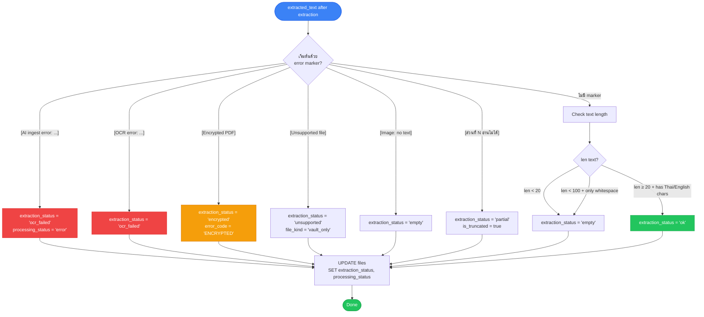

# 09 — Flow Charts (Business Logic Decisions)

> **Purpose:** Internal decision logic — branching ใน code ที่กำหนด behavior
> **Format:** Mermaid `flowchart` decision-tree diagrams
> **ต่างจาก Doc 08 อย่างไร:** Doc 08 = user-facing journey. Doc 09 = backend logic decisions ที่ developer ต้องเข้าใจ
> **Coverage:** 10 critical business logic flows

---

## ตารางสรุป

| # | Flow Chart | Source | Critical for |
|---|---|---|---|
| 1 | File Extraction Routing | extraction.py + ai_ingest.py | Knowing which handler runs per file |
| 2 | Extraction Status Classification | upload_worker.py + ai_ingest.py | Marking files ok/empty/error |
| 3 | Error Code Mapping | upload_worker.py (format_user_error) | Translating exceptions to user codes |
| 4 | Plan Limit Gate | plan_limits.py | Allowing/blocking actions per tier |
| 5 | Worker Job Priority Ranking | upload_worker.py (claim logic) | Round-robin fairness |
| 6 | Drive Sync Conflict Resolution | drive_sync.py | Push vs pull decisions |
| 7 | Smart-Merge Context Memory | context_memory.py | 2-hour merge window |
| 8 | MCP Tool Permission Check | mcp_tools.py + main.py /mcp/{secret} | Allow/deny tool calls |
| 9 | Auth Login Decision Tree | auth.py | Password/Google/locked outcomes |
| 10 | Stripe Webhook Event Routing | billing.py | Event → DB action mapping |

---

## 1. File Extraction Routing

**Source:** `backend/extraction.py` + `backend/ai_ingest.py`
**Trigger:** Worker picks up queued file → decides handler by extension

```mermaid
flowchart TD
    Start([File queued]) --> GetExt[Get filetype lowercase]
    
    GetExt --> Check{File ext?}
    
    Check -- "mp3, wav, m4a, flac,<br/>aac, ogg, opus, wma" --> Audio[ai_ingest._ingest_audio&#40;&#41;]
    Audio --> GeminiAudio[Upload to Gemini Files API<br/>+ wait_for_active&#40;&#41;<br/>+ Transcribe prompt]
    GeminiAudio --> ResultAudio[Return text or error marker]
    
    Check -- "mp4, mov, mkv, webm, avi,<br/>wmv, flv, m4v, 3gp" --> Video[ai_ingest._ingest_video&#40;&#41;]
    Video --> GeminiVideo[Upload + wait_for_active<br/>+ Analyze video prompt]
    GeminiVideo --> ResultVideo[Return text or error marker]
    
    Check -- "jpg, jpeg, png, webp, heic,<br/>heif, gif, bmp, tiff, tif" --> Image[ai_ingest._ingest_image_smart&#40;&#41;]
    Image --> SmartCheck{Tesseract works?}
    SmartCheck -- "ใช่ pure text image" --> Tesseract[Tesseract OCR Thai+Eng]
    Tesseract --> TessOK{ดี?}
    TessOK -- ใช่ --> ResultImg1[Return OCR text]
    TessOK -- ไม่ "low confidence" --> Fallback[ai_ingest&#41;Fallback to Gemini Vision]
    SmartCheck -- ไม่ "HEIC, complex" --> Fallback
    Fallback --> GeminiVision[Gemini Vision describe + extract]
    GeminiVision --> ResultImg2[Return text or error marker]
    
    Check -- "pdf" --> PDF[extraction.extract_text&#40;&#41;]
    PDF --> TextBased{PDF text-based?}
    TextBased -- ใช่ --> Docling[Docling extract first]
    Docling --> DoclingOK{Success?}
    DoclingOK -- ใช่ --> ResultPDF1[Return markdown]
    DoclingOK -- ไม่ --> PyPDF[Fallback: PyPDF2]
    PyPDF --> PyPDFOK{Got text?}
    PyPDFOK -- ใช่ --> ResultPDF2[Return text]
    PyPDFOK -- ไม่ "image-based PDF" --> OCR[Tesseract OCR each page<br/>⚠️ cap 20 pages]
    TextBased -- ไม่ --> OCR
    OCR --> OCRResult[Return OCR text + cap warning if >20 pages]
    
    Check -- "docx" --> DocX[python-docx]
    DocX --> ResultDocX[Return text]
    
    Check -- "xlsx" --> XLSX[openpyxl]
    XLSX --> ResultXLSX[Return text]
    
    Check -- "pptx" --> PPTX[python-pptx]
    PPTX --> ResultPPTX[Return text]
    
    Check -- "txt, csv, md, json,<br/>code files" --> Plain[UTF-8 read with encoding fallback]
    Plain --> EncodingTry[Try utf-8 → utf-16 → latin-1]
    EncodingTry --> ResultPlain[Return raw text]
    
    Check -- "html" --> HTML[beautifulsoup4 strip tags]
    HTML --> ResultHTML[Return clean text]
    
    Check -- "rtf" --> RTF[striprtf]
    RTF --> ResultRTF[Return text]
    
    Check -- "อื่นๆ unsupported" --> Vault[Mark as file_kind='vault_only'<br/>extraction_status='unsupported']
    Vault --> ResultVault[extracted_text = '[Vault — search by name]']
    
    ResultAudio --> Common[strip_surrogates&#40;text&#41;]
    ResultVideo --> Common
    ResultImg1 --> Common
    ResultImg2 --> Common
    ResultPDF1 --> Common
    ResultPDF2 --> Common
    OCRResult --> Common
    ResultDocX --> Common
    ResultXLSX --> Common
    ResultPPTX --> Common
    ResultPlain --> Common
    ResultHTML --> Common
    ResultRTF --> Common
    ResultVault --> Common
    
    Common --> Hash[Compute SHA-256 content_hash]
    Hash --> Classify[classify_extraction_status&#40;text&#41;<br/>ดู Flow Chart #2]
    Classify --> End([UPDATE files SET extracted_text, hash, status])
    
    style Start fill:#3b82f6,stroke:#2563eb,color:#fff
    style End fill:#22c55e,stroke:#16a34a,color:#fff
    style ResultVault fill:#f59e0b,stroke:#d97706,color:#fff
    style OCR fill:#f59e0b,stroke:#d97706,color:#fff
```

**Critical notes:**
- ทุก path ต้องผ่าน `strip_surrogates()` ก่อนเขียน DB (v9.3.3 fix)
- PDF OCR cap ที่ 20 หน้า — silent truncation, `is_truncated=true` flag set
- Gemini multimodal มี timeout 60s/image, 300s/video

---

## 2. Extraction Status Classification

**Source:** `classify_extraction_status()` ใน `upload_worker.py`
**Purpose:** ดู extracted text หลัง extraction แล้วตัดสินใจว่า file ok หรือมีปัญหา



**Status values:**
- `ok` — normal extraction, ready for organize
- `empty` — < 20 chars or whitespace only
- `encrypted` — PDF password-protected
- `ocr_failed` — extraction error marker detected
- `unsupported` — file_kind = vault_only (search by name only)
- `partial` — some chunks failed (large file map-reduce)

**Critical:** Organizer + AI pack builder filter `WHERE extraction_status='ok'` (v9.4.8) → กัน error files contaminate AI output

---

## 3. Error Code Mapping

**Source:** `format_user_error()` ใน `upload_worker.py:561-600`
**Purpose:** Exception → user-facing CODE → frontend translates to TH/EN

```mermaid
flowchart TD
    Start([Exception caught in worker]) --> ToString[Convert to str&#40;exception&#41;.lower&#40;&#41;]
    
    ToString --> Check{Match pattern?}
    
    Check -- "'password' in msg" --> ENC["CODE = 'ENCRYPTED'<br/>TH: ไฟล์ติดรหัส<br/>EN: Encrypted file"]
    Check -- "'no such file' or FileNotFoundError" --> MISS["CODE = 'FILE_MISSING'<br/>TH: ไฟล์หาย<br/>EN: File missing"]
    Check -- "'timeout' or 'timed out'" --> TO["CODE = 'TIMEOUT'<br/>TH: หมดเวลา<br/>EN: Timed out"]
    Check -- "MemoryError or 'memory'" --> MEM["CODE = 'OUT_OF_MEMORY'<br/>TH: หน่วยความจำเต็ม<br/>EN: Out of memory"]
    Check -- "UnicodeError" --> ENCODE["CODE = 'ENCODING'<br/>TH: อักขระเสีย<br/>EN: Encoding error"]
    Check -- "'quota' or 'rate limit' or '429'" --> QUOTA["CODE = 'QUOTA_EXCEEDED'<br/>TH: เกินโควต้า<br/>EN: Quota exceeded"]
    Check -- "'google' + '503'/'unavailable'" --> GEMUNAV["CODE = 'GEMINI_UNAVAILABLE'<br/>TH: Gemini ขัดข้อง<br/>EN: Gemini unavailable"]
    Check -- "'404' + 'not_found'/'no longer available'" --> DEP["CODE = 'MODEL_DEPRECATED'<br/>TH: โมเดลถูกยกเลิก<br/>EN: Model deprecated"]
    Check -- "'failed_precondition' or 'not in an active state'" --> NACT["CODE = 'FILE_NOT_ACTIVE'<br/>TH: ไฟล์ยังประมวลผลไม่เสร็จ<br/>EN: File not active"]
    Check -- "'permission_denied' or 'permission denied'" --> PERM["CODE = 'PERMISSION_DENIED'<br/>TH: ไม่มีสิทธิ์<br/>EN: Permission denied"]
    Check -- "'invalid_argument' or ClientError" --> CLIENT["CODE = 'CLIENT_ERROR'<br/>TH: ข้อมูลผิด<br/>EN: Bad input"]
    Check -- "'tesseract'" --> OCR["CODE = 'OCR_FAIL'<br/>TH: OCR ผิดพลาด<br/>EN: OCR failed"]
    Check -- "'connection' or 'network'" --> NET["CODE = 'NETWORK'<br/>TH: เน็ตขัดข้อง<br/>EN: Network error"]
    Check -- "'google' + 'auth'" --> GAUTH["CODE = 'GEMINI_AUTH'<br/>TH: Gemini auth ผิด<br/>EN: Gemini auth failed"]
    Check -- "none of above" --> UNK["CODE = 'UNKNOWN'<br/>TH: ขัดข้อง — ลองใหม่<br/>EN: Unknown — retry"]
    
    ENC --> Store
    MISS --> Store
    TO --> Store
    MEM --> Store
    ENCODE --> Store
    QUOTA --> Store
    GEMUNAV --> Store
    DEP --> Store
    NACT --> Store
    PERM --> Store
    CLIENT --> Store
    OCR --> Store
    NET --> Store
    GAUTH --> Store
    UNK --> Store
    
    Store[UPDATE files SET extract_error = CODE<br/>processing_status = 'error'<br/>attempt_count += 1]
    Store --> CheckRetry{attempt_count<br/>< MAX_RETRY 3?}
    CheckRetry -- ใช่ --> Retry[Allow user to retry]
    CheckRetry -- ไม่ --> Final[Mark as failed final<br/>show ดู logs message]
    
    Retry --> End([Wait for user action])
    Final --> End
    
    style Start fill:#3b82f6,stroke:#2563eb,color:#fff
    style End fill:#22c55e,stroke:#16a34a,color:#fff
    style ENC fill:#f59e0b,stroke:#d97706,color:#fff
    style UNK fill:#ef4444,stroke:#dc2626,color:#fff
```



**i18n boundary (v9.4.4):** Backend returns CODE only — frontend translates ตาม `localStorage.pdb_lang`

---

## 4. Plan Limit Gate

**Source:** `backend/plan_limits.py` — gate functions ที่ทุก action ผ่าน
**Purpose:** Pre-check ก่อน action — ห้าม check หลังเพราะ cost ไป Gemini แล้ว

```mermaid
flowchart TD
    Start([User action: upload / organize / chat / etc.]) --> GetUser[Load current_user]
    GetUser --> EffPlan[Compute effective plan]
    
    EffPlan --> P1{is_admin DB flag?}
    P1 -- ใช่ --> Admin[plan = 'admin']
    P1 -- ไม่ --> P2{email in ADMIN_EMAILS env?}
    P2 -- ใช่ --> Admin
    P2 -- ไม่ --> P3{subscription_status?}
    P3 -- "'starter_active'/'starter_past_due'/<br/>'starter_canceled' grace" --> Starter[plan = 'starter']
    P3 -- "else" --> Free[plan = 'free']
    
    Admin --> Limits[Load TIERS-plan]
    Starter --> Limits
    Free --> Limits
    
    Limits --> Action{Which action?}
    
    Action -- Upload --> UploadGate[check_upload_allowed&#40;&#41;]
    UploadGate --> U1{file_type supported?}
    U1 -- ไม่ --> Reject1[Return 'UNSUPPORTED_TYPE'<br/>+ Vault option]
    U1 -- ใช่ --> U2{file_size ≤ max_file_size_mb?}
    U2 -- ไม่ --> Reject2[Return 'FILE_TOO_LARGE']
    U2 -- ใช่ --> U3{file_count < file_limit?}
    U3 -- ไม่ --> Reject3[Return 'FILE_COUNT_EXCEEDED'<br/>+ upgrade hint]
    U3 -- ใช่ --> U4{storage_used + new_size ≤ storage_limit_mb?}
    U4 -- ไม่ --> Reject4[Return 'STORAGE_EXCEEDED'<br/>+ upgrade hint]
    U4 -- ใช่ --> Allow1[Return None — allowed]
    
    Action -- Summarize / Organize --> SumGate[check_summary_allowed&#40;&#41;]
    SumGate --> S1{summaries_this_month < ai_summary_limit_monthly?}
    S1 -- ไม่ --> Reject5[Return 'SUMMARY_LIMIT_EXCEEDED'<br/>+ upgrade]
    S1 -- ใช่ --> Allow2[Return None]
    
    Action -- Create Pack --> PackGate[check_pack_create_allowed&#40;&#41;]
    PackGate --> Pk1{pack_count < context_pack_limit?}
    Pk1 -- ไม่ --> Reject6[Return 'PACK_LIMIT_EXCEEDED']
    Pk1 -- ใช่ --> Allow3[Return None]
    
    Action -- Share Pack --> ShareGate[check_pack_share_create_allowed&#40;&#41;]
    ShareGate --> Sh1{shares_this_month < pack_share_limit_monthly?}
    Sh1 -- ไม่ --> Reject7[Return 'SHARE_LIMIT_EXCEEDED']
    Sh1 -- ใช่ --> Allow4[Return None]
    
    Action -- Refresh feature --> RefGate[check_refresh_allowed&#40;&#41;]
    RefGate --> R1{plan == 'free'?}
    R1 -- ใช่ --> Reject8["Return 'REFRESH_BLOCKED'<br/>(Free=0 entirely)"]
    R1 -- ไม่ --> R2{refresh_count < refresh_limit_monthly?}
    R2 -- ไม่ --> Reject9[Return 'REFRESH_LIMIT_EXCEEDED']
    R2 -- ใช่ --> Allow5[Return None]
    
    Action -- Semantic search --> SemGate[check_semantic_search_allowed&#40;&#41;]
    SemGate --> Sem1{plan has semantic_search_enabled?}
    Sem1 -- ไม่ --> Reject10[Return 'SEMANTIC_SEARCH_PRO_ONLY']
    Sem1 -- ใช่ --> Allow6[Return None]
    
    Reject1 --> HTTP402[Raise HTTPException 402<br/>+ upgrade=true]
    Reject2 --> HTTP402
    Reject3 --> HTTP402
    Reject4 --> HTTP402
    Reject5 --> HTTP402
    Reject6 --> HTTP402
    Reject7 --> HTTP402
    Reject8 --> HTTP402
    Reject9 --> HTTP402
    Reject10 --> HTTP402
    
    HTTP402 --> ShowUpsell[/Frontend: show upgrade modal/]
    
    Allow1 --> Proceed[Proceed with action]
    Allow2 --> Proceed
    Allow3 --> Proceed
    Allow4 --> Proceed
    Allow5 --> Proceed
    Allow6 --> Proceed
    
    Proceed --> LogUsage[After success: INSERT usage_logs]
    LogUsage --> End([Done])
    
    style Start fill:#3b82f6,stroke:#2563eb,color:#fff
    style End fill:#22c55e,stroke:#16a34a,color:#fff
    style HTTP402 fill:#f59e0b,stroke:#d97706,color:#fff
```



**Tier values (locked per ADR BILL-002):**
- Free: 50 files / 500 MB / 100 MB max / 50 summaries / 100 exports / 0 refresh / 5 shares / 10 queue
- Starter: 500 / 10 GB / 200 MB max / 1000 / 3000 / 100 refresh / 50 / 50
- Admin: 999999 (except queue=200 DoS guard)

---

## 5. Worker Job Priority Ranking

**Source:** `_claim_next_job()` ใน `upload_worker.py`
**Purpose:** Round-robin fairness — ห้ามให้ user เดียวยึดคิวยาว

```mermaid
flowchart TD
    Start([Worker loop tick - every 2s]) --> Query[SELECT * FROM files<br/>WHERE processing_status='queued'<br/>ORDER BY queued_at ASC]
    
    Query --> Empty{Any candidates?}
    Empty -- ไม่ --> Sleep[Sleep POLL_INTERVAL_SEC<br/>then loop]
    Sleep --> Start
    Empty -- ใช่ --> Rank[Rank in Python memory]
    
    Rank --> ForEach[For each candidate:]
    ForEach --> Track[Track per-user position<br/>per_user_pos&#91;user_id&#93; += 1]
    Track --> Priority[Determine priority class<br/>by filetype:]
    
    Priority --> Class{Filetype?}
    Class -- "txt, csv, code, small images" --> P1[priority_class = 1<br/>cap 5s]
    Class -- "pdf, docx, xlsx, pptx" --> P2[priority_class = 2<br/>cap 60s]
    Class -- "mp3, mp4, mov, large images" --> P3[priority_class = 3<br/>cap 300s]
    
    P1 --> Tuple[Build tuple:<br/>user_pos, priority_class, queued_at]
    P2 --> Tuple
    P3 --> Tuple
    
    Tuple --> Sort[Python sorted&#40;tuples&#41;<br/>lex order: user_pos → priority → queued_at]
    
    Sort --> Pick[chosen = ranked&#91;0&#93;]
    
    Pick --> AtomicClaim["UPDATE files<br/>SET processing_status='extracting',<br/>    extract_started_at=now<br/>WHERE id=:chosen.id<br/>  AND processing_status='queued'"]
    
    AtomicClaim --> Check{rowcount == 1?}
    Check -- ไม่ "lost race" --> Sleep
    Check -- ใช่ --> Process[Process the job<br/>ดู Flow Chart #1]
    
    Process --> Done[After extract:<br/>UPDATE files SET extracted_text, status]
    Done --> UpdateAvg[Update rolling avg per class<br/>α=0.2 exp smoothing<br/>cap at class cap]
    UpdateAvg --> Sleep
    
    style Start fill:#3b82f6,stroke:#2563eb,color:#fff
    style Process fill:#22c55e,stroke:#16a34a,color:#fff
    style AtomicClaim fill:#a78bfa,stroke:#8b5cf6,color:#fff
```

**Example ranking:**

| File | user | queued_at | priority | user_pos | Tuple |
|---|---|---|---|---|---|
| A | u1 | 12:00 | 2 (pdf) | 1 | (1, 2, 12:00) |
| B | u1 | 12:01 | 2 (pdf) | 2 | (2, 2, 12:01) |
| C | u2 | 12:02 | 1 (txt) | 1 | (1, 1, 12:02) |
| D | u3 | 12:03 | 3 (mp4) | 1 | (1, 3, 12:03) |

Sort → A, C, D, B → u1 doesn't monopolize

**Rolling avg outlier protection:**
- α = 0.2 exponential smoothing
- Cap per class (5/60/300s) — 1200s OCR PDF won't pollute typical 13s estimate

---

## 6. Drive Sync Conflict Resolution

**Source:** `drive_sync.py` — push-then-pull algorithm
**Purpose:** Drive = source of truth → server cache reconciles

```mermaid
flowchart TD
    Start([run_full_sync triggered]) --> Refresh[Refresh access_token]
    Refresh --> RefreshOK{Success?}
    
    RefreshOK -- "invalid_grant" --> Mark[_mark_drive_connection_errored&#40;&#41;<br/>status='error'<br/>error='INVALID_GRANT']
    Mark --> Return1[Return SyncStats<br/>status='completed_with_errors']
    
    RefreshOK -- ใช่ --> PrePush[PHASE 1: PUSH local → Drive]
    
    PrePush --> ListDrive[List Drive PDB folder<br/>F24 prevention pre-fetch]
    ListDrive --> LocalFiles[SELECT files WHERE<br/>storage_source='local' AND drive_file_id IS NULL]
    
    LocalFiles --> ForEach1[For each local-only file:]
    ForEach1 --> CheckDup{Drive has file with<br/>same name + hash?}
    
    CheckDup -- ใช่ --> Relink[UPDATE files SET drive_file_id<br/>duplicate_push_prevented++]
    CheckDup -- ไม่ --> UploadRaw[Upload to /raw/<br/>+ /extracted/<br/>+ /summaries/]
    UploadRaw --> SaveID[UPDATE files SET drive_file_id<br/>pushed_new++]
    
    Relink --> Next1{More files?}
    SaveID --> Next1
    Next1 -- ใช่ --> ForEach1
    Next1 -- ไม่ --> Pull[PHASE 2: PULL Drive → local]
    
    Pull --> ListAll[List all files in /raw/]
    ListAll --> ForEach2[For each Drive file:]
    
    ForEach2 --> InDB{drive_file_id in local DB?}
    InDB -- ไม่ --> Download[Download file from Drive]
    Download --> Insert[INSERT files<br/>SET file_kind='vault_only' until processed<br/>pulled_new++]
    
    InDB -- ใช่ --> CompareTime{drive_modifiedTime ><br/>cache_modified_at?}
    CompareTime -- "Drive newer" --> ReDownload[Re-download<br/>UPDATE files<br/>pulled_updated++]
    CompareTime -- "Cache same or newer" --> Skip[Skip - already synced]
    
    Insert --> Next2{More?}
    ReDownload --> Next2
    Skip --> Next2
    Next2 -- ใช่ --> ForEach2
    Next2 -- ไม่ --> Orphan[PHASE 3: Orphan cleanup]
    
    Orphan --> SelectOrphan[SELECT files WHERE<br/>drive_file_id IS NOT NULL]
    SelectOrphan --> CheckExist{Still exists in Drive?}
    
    CheckExist -- ไม่ --> Budget{_orphan_retry_count<br/>file_id ≥ 3?}
    Budget -- ใช่ --> SkipOrphan[orphans_skipped_budget++<br/>defer to next session]
    Budget -- ไม่ --> SoftDelete[UPDATE files<br/>SET deleted_in_drive=true<br/>orphans_cleaned++]
    SoftDelete --> IncRetry[_orphan_retry_count&#91;id&#93;++]
    
    CheckExist -- ใช่ --> NextO
    SkipOrphan --> NextO
    IncRetry --> NextO
    NextO{More orphans?} -- ใช่ --> SelectOrphan
    NextO -- ไม่ --> Stats
    
    Stats[Build SyncStats:<br/>pushed_new + pulled_new + updates +<br/>relinked + orphans_cleaned + errors]
    Stats --> UpdateConn[UPDATE drive_connections<br/>last_sync_at, last_sync_status]
    UpdateConn --> End([Return SyncStats])
    
    Return1 --> End
    
    style Start fill:#3b82f6,stroke:#2563eb,color:#fff
    style End fill:#22c55e,stroke:#16a34a,color:#fff
    style Mark fill:#ef4444,stroke:#dc2626,color:#fff
    style SkipOrphan fill:#f59e0b,stroke:#d97706,color:#fff
```



**Conflict policy:** Drive wins on `modifiedTime` (last-write-wins)
**F24 prevention:** Pre-fetch Drive listing → relink instead of duplicate upload
**Orphan budget:** Max 3 retries per session (in-memory dict) — avoid rate limit spam

---

## 7. Smart-Merge Context Memory

**Source:** `context_memory.py` — 2-hour merge window logic
**Purpose:** ห้ามให้ user สร้าง context ซ้ำๆ ทุก chat session

```mermaid
flowchart TD
    Start([MCP save_context หรือ POST /api/contexts]) --> Lookup[SELECT * FROM context_memories<br/>WHERE user_id=:uid AND title=:title<br/>ORDER BY updated_at DESC LIMIT 1]
    
    Lookup --> Exists{Found existing?}
    
    Exists -- ไม่ --> NewCheck[Check active limit]
    NewCheck --> CountActive[SELECT COUNT WHERE is_active=true]
    CountActive --> AtLimit{count ≥ 20?}
    AtLimit -- ใช่ --> Archive[UPDATE oldest non-pinned<br/>SET is_active=false<br/>auto-archive]
    AtLimit -- ไม่ --> Insert
    Archive --> Insert
    Insert[INSERT context_memories<br/>SET created_at, updated_at = now]
    Insert --> AutoSum{summary provided?}
    AutoSum -- ไม่ --> GenSummary[Generate 1-liner from content<br/>via LLM optional]
    AutoSum -- ใช่ --> Save
    GenSummary --> Save[Save row]
    Save --> Result1[Return id, merged=false]
    
    Exists -- ใช่ --> CheckAge[Calculate age = now - updated_at]
    CheckAge --> WithinWindow{age < 2 hours<br/>SMART_MERGE_HOURS?}
    
    WithinWindow -- ไม่ "old context" --> NewCheck
    
    WithinWindow -- ใช่ "merge it" --> Merge[Merge content:<br/>old.content + '\\n\\n---\\n\\n' + new.content]
    Merge --> CheckPinned{is_pinned change requested?}
    CheckPinned -- "set pinned=true" --> PinCheck[COUNT pinned WHERE is_pinned=true]
    PinCheck --> PinLimit{count ≥ 3?}
    PinLimit -- ใช่ --> RejectPin[Reject pin<br/>keep is_pinned=false]
    PinLimit -- ไม่ --> AllowPin[Set is_pinned=true]
    CheckPinned -- "no change" --> Update
    RejectPin --> Update
    AllowPin --> Update
    
    Update[UPDATE context_memories<br/>SET content, summary, updated_at=now<br/>last_used_at=now]
    Update --> Result2[Return id, merged=true]
    
    Result1 --> End([Done])
    Result2 --> End
    
    style Start fill:#3b82f6,stroke:#2563eb,color:#fff
    style End fill:#22c55e,stroke:#16a34a,color:#fff
    style Merge fill:#a78bfa,stroke:#8b5cf6,color:#fff
    style RejectPin fill:#f59e0b,stroke:#d97706,color:#fff
```

**Limits:**
- Max **20 active** per user (older auto-archived)
- Max **3 pinned** per user
- Smart-merge window: **2 hours** (constant `SMART_MERGE_HOURS`)

---

## 8. MCP Tool Permission Check

**Source:** `main.py` `/mcp/{secret}` handler + `mcp_tools.py` dispatcher
**Purpose:** Per-user tool toggle + admin bypass

```mermaid
flowchart TD
    Start([MCP tools/call request]) --> ParseURL[Extract secret from URL path]
    ParseURL --> Lookup[SELECT user WHERE mcp_secret=:s]
    
    Lookup --> UserFound{User found?}
    UserFound -- ไม่ --> Err1[Return JSON-RPC error 401]
    UserFound -- ใช่ --> Active{user.is_active?}
    Active -- ไม่ --> Err1
    Active -- ใช่ --> ParseTool[Parse tool name from params]
    
    ParseTool -- "Bearer token instead" --> BearerCheck[SHA-256 hash lookup<br/>in mcp_tokens]
    BearerCheck --> TokenFound{Active + not revoked?}
    TokenFound -- ไม่ --> Err1
    TokenFound -- ใช่ --> ParseTool
    
    ParseTool --> Registered{Tool in TOOL_REGISTRY<br/>or dispatcher?}
    Registered -- ไม่ --> Err2[Return error: 'Unknown tool']
    Registered -- ใช่ --> CheckPerm[Get MCP_PERMISSIONS-user_id<br/>tool_name]
    
    CheckPerm --> Default{Permission set?}
    Default -- "ไม่ set" --> AllowDefault[Default: allowed]
    Default -- "ใช่" --> PermValue{Permission value?}
    PermValue -- "true" --> AllowDefault
    PermValue -- "false" --> Disabled[Tool disabled]
    
    Disabled --> AdminCheck{Request has admin_key<br/>matching ADMIN_PASSWORD?}
    AdminCheck -- ใช่ --> AllowAdmin[Bypass for admin]
    AdminCheck -- ไม่ --> Err3[Return error: 'Tool disabled<br/>by user permissions']
    
    AllowDefault --> CheckDestr{Destructive tool?<br/>delete_file/delete_pack/unlink_nodes}
    AllowAdmin --> Execute
    
    CheckDestr -- ใช่ --> AdminGate{admin_key validates?}
    AdminGate -- ไม่ --> Err4[Return error: 'Admin password required']
    AdminGate -- ใช่ --> Execute
    CheckDestr -- ไม่ --> Execute[Execute tool function]
    
    Execute --> StartTimer[start = monotonic&#40;&#41;]
    StartTimer --> CallFunc[call_tool name, args, user_id]
    CallFunc --> Result{Result?}
    
    Result -- "exception" --> CatchErr[Format error response]
    Result -- "dict with __mcp_content" --> PassThrough[Use content array as-is<br/>EmbeddedResource]
    Result -- "normal dict" --> Wrap[Wrap: content=text JSON.stringify result]
    
    CatchErr --> Log
    PassThrough --> Log
    Wrap --> Log[INSERT mcp_usage_logs<br/>tool_name, latency_ms, status]
    
    Log --> Return[Return JSON-RPC response]
    Return --> End([Done])
    
    Err1 --> End
    Err2 --> End
    Err3 --> End
    Err4 --> End
    
    style Start fill:#3b82f6,stroke:#2563eb,color:#fff
    style End fill:#22c55e,stroke:#16a34a,color:#fff
    style Err1 fill:#ef4444,stroke:#dc2626,color:#fff
    style Disabled fill:#f59e0b,stroke:#d97706,color:#fff
```



**Permission storage:** In-memory dict `MCP_PERMISSIONS[user_id][tool_name] = bool`, persisted to DB via `PUT /api/mcp/permissions`

**Special response handling:** Tool returns dict with `__mcp_content` key → pass through (for `export_file_to_chat` EmbeddedResource)

---

## 9. Auth Login Decision Tree

**Source:** `backend/auth.py` + `backend/google_login.py`
**Purpose:** Handle email/password vs Google OAuth vs locked accounts

```mermaid
flowchart TD
    Start([Login request]) --> Type{Login type?}
    
    Type -- Email/password --> EmailFlow["POST /api/auth/login {email, password}"]
    Type -- Google --> GoogleFlow[OAuth flow]
    
    EmailFlow --> Lookup[SELECT users WHERE email=:e]
    Lookup --> Found{Found?}
    Found -- ไม่ --> EmailErr[Return 401<br/>uniform 'invalid credentials']
    Found -- ใช่ --> CheckActive{is_active?}
    CheckActive -- ไม่ --> Disabled[Return 401<br/>'Account disabled']
    CheckActive -- ใช่ --> CheckHash{password_hash IS NULL?}
    
    CheckHash -- "ใช่ Google-only user" --> UseGoogle[Return 401<br/>code='USE_GOOGLE_LOGIN'<br/>frontend shows Google button]
    CheckHash -- ไม่ --> Verify[bcrypt.checkpw&#40;password, hash&#41;<br/>constant-time]
    
    Verify --> Match{Match?}
    Match -- ไม่ --> EmailErr
    Match -- ใช่ --> IssueJWT[create_access_token]
    IssueJWT --> Success[Return token + user]
    
    GoogleFlow --> InitOAuth["GET /api/auth/google/init"]
    InitOAuth --> GenPKCE[Generate code_verifier + challenge<br/>+ state token]
    GenPKCE --> StoreCache[Store in _GLOGIN_STATE_CACHE<br/>TTL 10min]
    StoreCache --> AuthURL[Return auth_url to frontend]
    AuthURL --> UserConsent[User consents at Google]
    UserConsent --> Callback["GET /api/auth/google/callback<br/>?code=X&state=Y"]
    
    Callback --> VerifyState[Check state in cache]
    VerifyState --> StateOK{Valid + not expired?}
    StateOK -- ไม่ --> CSRFErr[Return 400 'Bad state']
    StateOK -- ใช่ --> ExchangeCode[Exchange code → id_token<br/>via Google API + PKCE]
    
    ExchangeCode --> VerifyID[Local verify id_token:<br/>- signature<br/>- audience<br/>- exp + clock skew 60s]
    VerifyID --> IDOK{Valid?}
    IDOK -- ไม่ --> SigErr[Return 400 'Bad token']
    IDOK -- ใช่ --> Extract[Extract:<br/>google_sub<br/>email<br/>email_verified<br/>name]
    
    Extract --> VerifiedEmail{email_verified?}
    VerifiedEmail -- ไม่ --> Reject[Return 401<br/>'Email not verified']
    VerifiedEmail -- ใช่ --> Lookup2{Lookup priority}
    
    Lookup2 --> ByGoogleSub[Try google_sub immutable]
    ByGoogleSub --> Match1{Found?}
    Match1 -- ใช่ --> ExistingUser[Use existing user]
    Match1 -- ไม่ --> ByEmail[Try email]
    ByEmail --> Match2{Found + same email?}
    Match2 -- ใช่ --> LinkAccount[Link Google to existing<br/>UPDATE users SET google_sub]
    Match2 -- ไม่ --> Create[Create new user<br/>password_hash = NULL<br/>google_sub set]
    
    ExistingUser --> IssueJWT
    LinkAccount --> IssueJWT
    Create --> IssueJWT
    
    style Start fill:#3b82f6,stroke:#2563eb,color:#fff
    style Success fill:#22c55e,stroke:#16a34a,color:#fff
    style EmailErr fill:#ef4444,stroke:#dc2626,color:#fff
    style UseGoogle fill:#a78bfa,stroke:#8b5cf6,color:#fff
```



**Critical state caches:**
- `_GLOGIN_STATE_CACHE` (login) — แยกจาก `_STATE_CACHE` (Drive OAuth) เพื่อ intent isolation

---

## 10. Stripe Webhook Event Routing

**Source:** `backend/billing.py`
**Purpose:** Process Stripe events idempotently → update subscription state

```mermaid
flowchart TD
    Start([POST /api/stripe/webhook]) --> ReadRaw[Read raw body bytes]
    ReadRaw --> ParseSig[Get Stripe-Signature header]
    ParseSig --> Verify[stripe.Webhook.construct_event<br/>with STRIPE_WEBHOOK_SECRET]
    
    Verify --> SigOK{Valid signature?}
    SigOK -- ไม่ --> Err1[Return 400<br/>'Invalid signature']
    SigOK -- ใช่ --> ParseEvent[Parse event = id, type, data]
    
    ParseEvent --> CheckLog[SELECT webhook_logs WHERE event_id=:id]
    CheckLog --> Idempotent{Already processed?}
    Idempotent -- ใช่ --> SkipReturn[Return 200<br/>idempotent skip]
    Idempotent -- ไม่ --> InsertLog[INSERT webhook_logs<br/>status='processing']
    
    InsertLog --> Route{event.type?}
    
    Route -- "checkout.session.completed" --> CO1[Get customer_id + email<br/>+ subscription_id]
    CO1 --> CO2[UPDATE users SET<br/>subscription_status='starter_active',<br/>plan='starter',<br/>stripe_customer_id]
    CO2 --> CO3[unlock_data_for_plan&#40;starter&#41;]
    CO3 --> CO4[INSERT audit_logs<br/>event='plan_changed']
    CO4 --> Mark
    
    Route -- "customer.subscription.created" --> SC1[Update renewal_date + status]
    SC1 --> Mark
    
    Route -- "customer.subscription.updated" --> SU1{Status changed?}
    SU1 -- ใช่ --> SU2[UPDATE users SET<br/>subscription_status renewal_date]
    SU1 -- ไม่ --> Mark
    SU2 --> Mark
    
    Route -- "customer.subscription.deleted" --> SD1[UPDATE users SET<br/>subscription_status='free'<br/>plan='free']
    SD1 --> SD2[lock_excess_data&#40;user&#41;<br/>most-recent items kept]
    SD2 --> SD3[INSERT audit_logs<br/>event='plan_changed']
    SD3 --> Mark
    
    Route -- "invoice.payment_succeeded" --> IS1[INSERT audit_logs<br/>event='payment_received']
    IS1 --> Mark
    
    Route -- "invoice.payment_failed" --> IF1[INSERT audit_logs<br/>event='payment_failed']
    IF1 --> IF2[UPDATE users SET<br/>subscription_status='starter_past_due']
    IF2 --> Mark
    
    Route -- "อื่นๆ unknown event" --> Skip[Skip — no handler]
    Skip --> Mark
    
    Mark[UPDATE webhook_logs<br/>SET status='processed']
    Mark --> Return[Return 200]
    Return --> End([Done])
    
    SkipReturn --> End
    Err1 --> End
    
    Verify -- "exception" --> CatchExc[INSERT webhook_logs<br/>status='error']
    CatchExc --> Err2[Return 500]
    Err2 --> End
    
    style Start fill:#3b82f6,stroke:#2563eb,color:#fff
    style End fill:#22c55e,stroke:#16a34a,color:#fff
    style Idempotent fill:#a78bfa,stroke:#8b5cf6,color:#fff
    style SD2 fill:#f59e0b,stroke:#d97706,color:#fff
```



**Idempotency contract:** event_id check ใน `webhook_logs` ก่อน process — Stripe retries safe

**Lock excess data (downgrade):**
- ลบไฟล์ส่วนเกิน → ทำ soft-lock (`is_locked=true`) แทน
- Most-recent items kept unlocked up to new tier limit
- Data **never deleted** — re-upgrade = unlock

---

## Summary

10 flow charts covering critical decision logic:

| Flow | Decision points | Source file |
|---|---|---|
| 1. Extraction routing | ~10 ext groups | extraction.py + ai_ingest.py |
| 2. Status classification | 6 status values | upload_worker.py |
| 3. Error mapping | 15 CODE outcomes | upload_worker.py format_user_error |
| 4. Plan limit gates | 7 gate functions × 3 tiers | plan_limits.py |
| 5. Worker priority | 3-tuple sort (user_pos, class, time) | upload_worker.py _claim_next_job |
| 6. Drive sync | Push + pull + orphan budget | drive_sync.py |
| 7. Context merge | 2-hour window + pin limit 3 | context_memory.py |
| 8. MCP permission | Default + admin bypass + destructive guard | main.py + mcp_tools.py |
| 9. Auth login | Email/password/Google priority + state cache | auth.py + google_login.py |
| 10. Stripe webhook | 6 event types → DB actions | billing.py |

---

**End — All flows extracted from real source code logic, no hypothetical paths**
